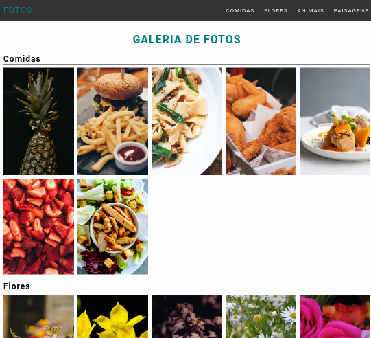
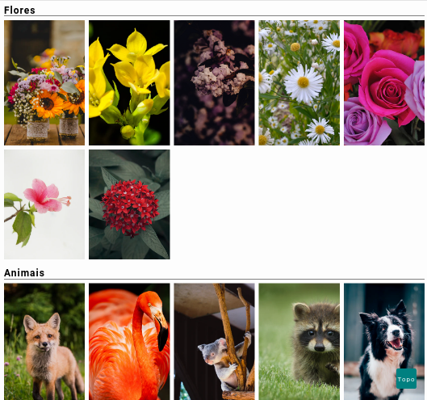
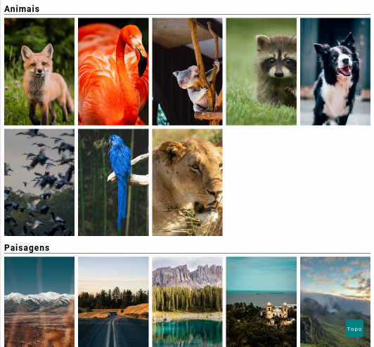
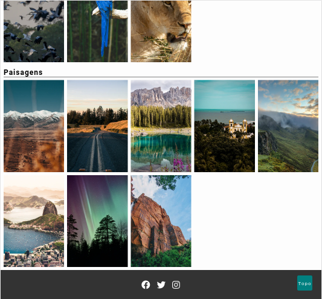

# Galeria de fotos
Este é um simples projeto com a finalidade de treinar habilidades relativa as linguagens **JavaScript**,**HTML** e **CSS**. O projeto consiste em uma galeria de fotos **responsiva** que redireciona o usuário para a seção desejada. Qualquer sugestão de melhoria será muito bem-vinda :)

## Layout
<table >
    <tr>
        <td>
                 
        </td>
        <td>
            
        </td>
        <td>
                    
        </td>
        <td>
             
        </td>
    </tr>
</table>

## Linguagens
* JavaScript
* HTML
* CSS

## Executar
**Para executar este pojeto na sua máquina, siga as intruções:**
* execute o seguinte comando no seu terminal: 
> $ git clone https://github.com/dhayananascimento/galeria-de-fotos.git
* abra a pasta que será  criada
* abra o arquivo "index.html" com o navegador de sua preferência
